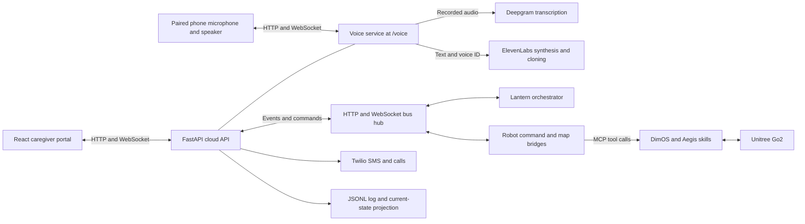

# Lantern — HackMIT

Lantern is a voice-enabled Unitree Go2 companion and caregiver portal, built as a HackMIT prototype for supporting families caring for someone with dementia. It connects familiar-voice check-ins, spoken robot requests, home mapping, and an event-driven Night Watch dashboard.

A caregiver can send a message from the web app, hear it delivered through a paired phone, and see the person's transcribed reply. The same phone can submit explicit walking and robot-action requests. DimOS supplies perception, navigation, and hardware connectivity; our Python skills add companion behaviors, room-map export, and a recorded home position. The portal brings together configuration, maps, activity, alerts, and caregiver acknowledgment.

This is a completed hackathon prototype, not a clinically validated care system or a replacement for supervision. It includes live integrations, mock scenarios, and unfinished production concerns. This README describes the code on `main`; the original planning documents in [docs/](docs/) include ambitions broader than the shipped implementation. The robot skill package retains the earlier **Aegis** name.

## What we built

| Area | Implementation |
|---|---|
| Caregiver portal | React/TypeScript app with onboarding, household check-ins, daily routines, Night Watch, maps, alerts, and an activity timeline. |
| Phone voice interface | Browser microphone/speaker, private QR pairing, WebSocket delivery, playback acknowledgment, typed input, and separate check-in/robot-request controls. |
| Speech recognition | Server-side Deepgram transcription of completed browser recordings. |
| Speech generation | Server-side ElevenLabs text-to-speech and optional custom caregiver voice enrollment. |
| Robot commands | Phrase-based intent recognition, orchestrator state transitions, and a bridge invoking DimOS MCP tools. |
| Companion skills | Named locations, navigation, person detection/following, guided routes, danger zones, object-location memory, and home navigation. |
| Room mapping | DimOS frontier exploration and point-cloud capture, PLY/JSON export, and an interactive browser viewer. |
| Night Watch | Zone/track events drive policy states, spoken prompts, alert escalation, acknowledgment, and event-log reports. |
| Hardware-free demo | Mock patient/robot scenarios and a scripted portal walk exercise event processing and presentation. |

## Architecture

The project separates speech, product policy, hardware control, and caregiver presentation. The phone is the microphone/speaker for this implementation; it does not connect directly to the Go2.



Default local ports are **5173** for Vite, **8000** for the combined cloud/voice API, and **9000** for the shared bus. Vite proxies `/api`, `/ws`, and `/voice` to the API so the portal and phone share one HTTPS tunnel.

The common event envelope has `type`, `ts`, `source`, `seq`, and `payload`. Events include `person_track`, `pose`, `agent_state`, `command`, `robot_status`, `say`, `transcript`, `alert`, and `caregiver_ack`. See [docs/04-interfaces.md](docs/04-interfaces.md). Private voice-session metadata and some demo extensions also exist in code; the contract document does not imply strict validation of every runtime payload.

The bus accepts HTTP publishes at `/publish` and WebSocket connections at `/ws`. The orchestrator's cloud bridge posts events to `/api/ingest`. Cloud appends them to JSONL, updates its in-memory state projection, and broadcasts them to portal clients. Each portal connection receives a snapshot followed by incremental events. Reports query the recorded events.

## Voice implementation

### Phone pairing and a complete check-in

The portal creates a temporary session with separate random caregiver and phone tokens. The pairing URL carries phone credentials in its fragment. The phone stores them in `sessionStorage`, removes the fragment from the visible address, and authenticates its WebSocket with the token. Only one phone can occupy a session.

Tapping **Start Lantern** activates browser audio and marks the phone ready. Hiding the page pauses the session and releases the microphone; reconnection requires another Start tap. Sessions are process-local, expire after 12 hours, and disappear on server restart.

A caregiver check-in follows this sequence:

1. The portal submits the message and sender name.
2. The voice backend checks that the phone is ready and the policy state permits a check-in. The mounted phone path allows `IDLE` or `ATTEND`; it rejects conflicting safety interactions rather than queuing them.
3. The backend creates a `say` payload with an `utterance_id` and delivers it over the phone WebSocket.
4. The phone requests audio from the backend, plays it using Web Audio, and reports `speaking`, `delivered`, `interrupted`, or `failed`.
5. After a caregiver message finishes, the phone automatically records a reply for up to **five seconds**. Manual completion and typed replies are also available.
6. The recording is transcribed, associated with the active `checkin_id`, and displayed in the caregiver conversation/timeline.
7. Lantern speaks: “Thank you. Your caregiver can view your message on their dashboard.”

`turn_id` values deduplicate replies; `checkin_id` rejects replies to older check-ins; `utterance_id` rejects stale playback updates. Cancellation/version checks discard late results after interruption. Generated audio is temporarily cached so playback retries can reuse it.

### Deepgram: audio to text

[voice/static/phone.js](voice/static/phone.js) uses `getUserMedia` and `MediaRecorder` to capture supported WebM, MP4, or Ogg audio. The browser requests echo cancellation, noise suppression, and automatic gain control. Microphone tracks stop when capture ends.

The phone uploads a completed recording to `/voice/api/sessions/{session_id}/transcribe`. The backend validates the media type and enforces a 5 MiB upload limit. [voice/providers.py](voice/providers.py) posts the bytes to Deepgram's `/v1/listen` endpoint, with the default model `nova-3` and `smart_format=true`. `DEEPGRAM_MODEL` can override the model.

This is **record-and-upload speech recognition**, not continuous streaming STT. Deepgram recognizes words; it does not decide robot behavior. Without a Deepgram key, the phone can use browser recognition where supported or typed input. Browser recognition may itself use a network service.

### ElevenLabs: text to speech and custom voices

The backend sends text and a voice ID to ElevenLabs' `/v1/text-to-speech/{voice_id}` endpoint. The default model is `eleven_flash_v2_5`, configurable through `ELEVENLABS_MODEL_ID`. Ordinary synthesis returns MP3 audio. Provider keys stay on the backend.

Onboarding records **ten seconds** and uploads the sample to `/api/onboarding/voice-clone`. The backend sends it to ElevenLabs' `/v1/voices/add` endpoint and saves the returned `voice_id` in configuration. We use a hosted cloning service; we do not train a voice model in this repository.

For a nonempty custom caregiver message, with a clone and default voice configured:

- The default voice speaks the attribution, such as “Sarah sent you this message.”
- The cloned voice speaks the caregiver's message.
- The backend requests both parts as 24 kHz PCM and joins them into one mono WAV before playback.

Joining samples rather than independent MP3 files prevents playback ending after the introduction. The phone starts listening after the complete clip. Lantern's own acknowledgment uses the default voice.

The current configuration selects one custom voice; the preset household is not a complete per-person voice-management system. Use only recordings whose owner has consented. Synthesis checks `ELEVENLABS_VOICE_CONSENT=true`, but enrollment currently timestamps a successful upload without a separate consent checkbox. Audited consent and revocation remain unfinished.

### Dialogue and policy

[voice/dialogue.py](voice/dialogue.py) returns the fixed acknowledgment above. Simple keyword matching flags terms such as “help,” “pain,” or “scared” for caregiver attention. It is not an LLM conversation engine or a validated distress detector.

The division of responsibility is: **Deepgram turns audio into text; our application routes it and chooses a response or action; ElevenLabs turns selected text into audio.** Optional agentic DimOS blueprints are separate from the scripted phone dialogue.

## Spoken robot requests

Robot requests use a separate phone control, with a **ten-second** recording limit. Their transcripts have no check-in ID. The intended route is:

```text
Phone → Deepgram → voice/cloud bridge → bus hub → orchestrator
      → command event → DimOS command bridge → MCP skill → Go2
```

[intent.py](orchestrator/lantern_orch/intent.py) normalizes text and recognizes supported phrases; [machine.py](orchestrator/lantern_orch/machine.py) applies state-dependent transitions. This path does not rely on an LLM selecting a tool.

| Request | Behavior |
|---|---|
| “Go on a walk” / “Follow me” | Enters WALK from an eligible state; starts breadcrumb recording and person following. |
| “Take me home” | Enters CONFIRM_HOME during an active walk/follow interaction. |
| “Yes” / “No” | Confirms return home or resumes the prior walking state. |
| “Stop” | Stops the supported walking flow and clears the orchestrator's trail. |
| “Sit,” “stand up,” “wave,” “dance,” and other recognized actions | Sends a posture command with a named DimOS sport action. |

The final action vocabulary also includes jumps and flips. It is a demonstration vocabulary, not a care-environment safety guarantee. Phrase matching does not provide general semantic understanding or robust negation handling. **Stop speaking** stops phone audio; it is not the robot emergency stop.

[robot/dimos_command_bridge.py](robot/dimos_command_bridge.py) runs separately and invokes `dimos mcp call`. It deduplicates command IDs and reports acceptance, invocation failure, or execution status. A successful CLI invocation is not proof of physical completion. It handles following, home requests, stop-following, and named sport commands; it does **not** implement every Night Watch command, including `lead_to`.

## Robot skills and spatial behavior

We composed high-level Python skills over DimOS navigation, perception, spatial memory, and capability handling rather than writing a new robot driver or SLAM system.

| Module | Contribution |
|---|---|
| [locations.py](hackmitdog/aegis/locations.py) | Save/list/delete named places and navigate to them. |
| [navigation_skills.py](hackmitdog/aegis/navigation_skills.py) | Relative turns, obstacle approach, waypoint patrols. |
| [person.py](hackmitdog/aegis/person.py) | Local YOLO person acquisition, follow/stop-follow, escort composition. |
| [follow_control.py](hackmitdog/aegis/follow_control.py) | Configurable following distance using the existing DimOS tracking/control loop. |
| [guided_walk.py](hackmitdog/aegis/guided_walk.py) | Save and execute routes through named locations. |
| [danger_zone.py](hackmitdog/aegis/danger_zone.py) | Polygon containment/distance, zone monitoring, candidate-position geometry. |
| [object_memory.py](hackmitdog/aegis/object_memory.py) | Store/look up object locations and navigate to search locations. |
| [home.py](hackmitdog/aegis/home.py) | Navigate to a configured home location and stop that behavior. |
| [map_skill.py](hackmitdog/aegis/map_skill.py) | Bounded exploration, point-cloud export, map publication. |

Following initializes the underlying follower with a local YOLO detection. Our configurable follower avoids exposing duplicate MCP tool names that would bypass that wrapper. Escort/guided-walk completion does not prove the person remained alongside the robot; capturing a frame during object search does not itself verify object detection.

### Breadcrumb recording and home navigation

[orchestrator/breadcrumb.py](orchestrator/breadcrumb.py) subscribes to odometry. The first point becomes home; later points are stored after the robot moves the configured spacing, normally 0.5 m. Tools expose recording, stopping, clearing, and trail status.

The implemented `take_me_home` publishes the saved home pose to DimOS navigation. **The planner computes a route using its current costmap; the skill does not replay every breadcrumb in reverse.** Some design documents describe fuller breadcrumb retracing. This implementation does not require GPS or claim successful docking/charging.

[aegis_breadcrumb.py](orchestrator/aegis_breadcrumb.py) combines these tools with Aegis on one Go2 connection. `hackmitdog.breadcrumb` exposes MCP tools without an LLM client. `hackmitdog.aegis-breadcrumb-agentic` adds an MCP client. Aegis-only, hosted-agent, Ollama, and simulation entry points are also registered in [pyproject.toml](pyproject.toml).

## Mapping and the portal

Onboarding collects person details, an optional voice sample, home map/zones, and routine information. Zones are painted Safe, Watch, or “Don't go”; the last category uses the event value `exit`.

The primary scan button explicitly requests a **live** scan. A separate demo option loads a schematic floorplan. In live mode:

1. Cloud publishes `map_scan_request` with a request ID.
2. [robot/dimos_map_bridge.py](robot/dimos_map_bridge.py) calls the `map_room` MCP skill.
3. The skill runs bounded DimOS frontier exploration and captures the global point cloud.
4. It filters invalid points, optionally downsamples, and exports ASCII PLY plus a JSON sidecar.
5. It posts `map_ready` to cloud; the portal matches the request ID and completes the scan.
6. The API serves map files, and [Map3D.tsx](cloud/web/src/views/Map3D.tsx) parses PLY and draws an interactive canvas point-cloud view.

The 2D room outline is a bounding envelope, not semantic room segmentation. Artifacts remain in the mapping frame; integration must honor the metre-based portal contract and its origin. The API serves `artifacts/maps` or `LANTERN_MAP_ARTIFACT_DIR`. If mapping and cloud run on different machines, files must be shared/copied to that directory and their URLs made browser-reachable. Sending an artifact URL alone does not transfer a file.

The dashboard includes routine editing, emergency contacts, check-in conversation, speaker pairing, state/timeline panels, maps, and live-tracking views. Routine definitions are saved as configuration; completion ticks are local UI state. A preset household and sample routines support the demo. The routine screen is not an autonomous reminder scheduler.

## Night Watch, alerts, and reports

The state machine includes IDLE, ATTEND, LEAD, ESCALATE, and EMERGENCY, plus WALK, FOLLOW, CONFIRM_HOME, and GUIDE_HOME. Inputs include person tracks, zones, robot pose/status, and caregiver acknowledgment.

Policy heuristics include direction reversals, a projected exit, continued presence near the door, an explicit outside breach, and lying posture outside a bed zone. These are prototype rules. Real tracking quality and coordinate alignment remain dependencies; mocks and scripted scenarios supply these inputs for demonstrations.

[cloud/server/speaker.py](cloud/server/speaker.py) separately turns Night Watch zone/track events into short phrases for the ready phone, with repeat intervals. Without a ready phone, it records the speech event in the portal. A `say` event in the timeline does not by itself prove audible playback: the event-stream and phone-delivery paths are distinct.

[escalation.py](cloud/server/escalation.py) manages alert timers. Normal alerts requiring acknowledgment can send SMS, then call a primary contact after 60 seconds and a secondary contact after 120 seconds. `LANTERN_FAST_LADDER=1` reduces delays to 8 and 16 seconds. High-urgency breaches can trigger immediate calls. Acknowledgment cancels pending tasks. Without Twilio credentials/destination numbers, notifications dry-run to logs.

The current adapter selects recipients from environment variables, including primary/secondary overrides. Onboarding contacts are not a complete dynamic contact-routing implementation. Although the call text asks for a keypress, there is no working DTMF acknowledgment callback; use the portal or acknowledgment link.

The morning report groups recorded events into episodes with reasons, peak state, duration, and resolution. It is a deterministic event summary.

## Repository layout

```text
cloud/server/          API, event projection, alerts, reports, voice mounting
cloud/web/             React/TypeScript portal and map viewer
cloud/fixtures/        Demonstration event streams and maps
voice/                 Phone service, browser audio, provider adapters, dialogue
bus/                   Event envelope, pub/sub core, HTTP/WebSocket hub
orchestrator/          State machine, intent recognition, mocks, runners
robot/                 External DimOS command and map bridges
hackmitdog/aegis/      Companion skills and blueprint composition
artifacts/maps/        Captured PLY maps and JSON sidecars
docs/                  Original product, interface, safety, development plans
```

During development, E1 owned voice, E2 robot, E3 cloud/portal, and E4 orchestrator/bus. Shared envelopes and mocks supported independent development, followed by integration through HTTP, WebSockets, and MCP.

## Run locally

### Installation

Use **Python 3.12+** for the repository package and **Node 20.19+ in the 20.x line or 22.12+** for the checked-in Vite version. Hardware execution additionally needs a compatible DimOS installation and Go2 connection setup; application requirements do not install that stack.

Create and activate an environment from the repository root:

```powershell
# Windows PowerShell
python -m venv .venv
.\.venv\Scripts\Activate.ps1
```

```bash
# macOS / Linux
python3 -m venv .venv
source .venv/bin/activate
```

Then install:

```text
python -m pip install -r cloud/requirements.txt -r voice/requirements.txt -r orchestrator/requirements.txt -r bus/requirements.txt
npm --prefix cloud/web ci
```

### Configuration

Edit the following local files without overwriting existing secrets. Restart the API after backend environment changes and Vite after frontend environment changes.

**Repository-root `.env` — voice:**

```dotenv
DEEPGRAM_API_KEY=<your-key>
DEEPGRAM_MODEL=nova-3
ELEVENLABS_API_KEY=<your-key>
ELEVENLABS_VOICE_ID=<approved-default-voice-id>
ELEVENLABS_VOICE_CONSENT=true
ELEVENLABS_MODEL_ID=eleven_flash_v2_5
```

Set the consent flag only for an approved voice. Hosted voice requires these credentials; browser fallbacks can be used where supported without them. Cloning also requires account eligibility and an available custom-voice slot. The account behind the server API key is the one used.

The voice app loads root `.env` with `override=True`, overriding existing process values for entries in that file. Avoid duplicate keys across configuration files. `.env.example` files are templates, not active configuration.

**`cloud/.env` — cloud/bus and optional services:**

```dotenv
LANTERN_ORCH_PUBLISH_URL=http://127.0.0.1:9000
MAP_SCAN_MODE=demo
LANTERN_FAST_LADDER=1
ACK_BASE_URL=http://127.0.0.1:5173
```

`MAP_SCAN_MODE` is the API default when a caller omits its mode; the primary onboarding scan button explicitly sends `live`. `LANTERN_ORCH_PUBLISH_URL` points to the bus host and can be omitted for portal/voice-only operation without robot requests. See [cloud/.env.example](cloud/.env.example) for Twilio, camera, and map-artifact variables.

### Start the API and portal

In one terminal, with the Python environment active:

```text
python -m uvicorn main:app --app-dir cloud/server --host 127.0.0.1 --port 8000
```

In a second terminal:

```text
npm --prefix cloud/web run dev
```

Open `http://127.0.0.1:5173`. Routes are `/` (Welcome), `/onboarding` (setup), and `/watch` (dashboard). Voice health/configuration is at `/voice/api/health`. Voice is already mounted inside the API: do not start a competing standalone voice server on port 8000. Run one API worker because sessions/projections are process-local.

### Phone access over HTTPS

With the API and Vite running:

```text
cloudflared tunnel --protocol http2 --url http://127.0.0.1:5173
```

Put the generated origin in `cloud/web/.env.local`:

```dotenv
VITE_PUBLIC_ORIGIN=https://<your-tunnel>.trycloudflare.com
```

For external acknowledgment links, set `ACK_BASE_URL` in `cloud/.env` to the same origin. Restart the relevant services, open the HTTPS portal, and pair through its speaker/check-in controls. Tap Start Lantern and keep the phone foregrounded.

A phone's `localhost` refers to itself. New Quick Tunnels get new URLs; update configuration and pairing links accordingly. HTTP/2 selects the connector-to-Cloudflare transport; it cannot fix an HTTPS timeout while requesting a new tunnel URL from `api.trycloudflare.com`.

### Mock scenarios

With cloud running:

```text
python orchestrator/run_spine.py --scenario exit_seeking
```

This starts the bus, hub on port 9000, state machine, mock patient/robot, and cloud bridge. It runs a finite scenario, waits for its hold period, then exits. For a longer manual session:

```text
python orchestrator/run_spine.py --scenario calm --hold 3600
```

Do not start another hub on the same port. The portal's scripted demo walk is another demo source. Neither mock route proves real person tracking or robot motion.

### Real robot processes

Run each long-running command in its own terminal, alongside the API/frontend. In the application Python environment:

```text
python bus/run_hub.py --port 9000
python orchestrator/run_orchestrator.py --bus-url ws://127.0.0.1:9000/ws --cloud http://127.0.0.1:8000
```

The orchestrator publishes demo defaults at startup; apply the intended household configuration afterward. Resolve the transcript-forwarding regression documented below before relying on this path for a new hardware session.

On the robot-connected computer, activate the environment that already contains DimOS and install this repository:

```text
python -m pip install -e .
dimos list
```

Use `uv pip install -e .` if the environment is managed by uv. The non-LLM combined blueprint is `hackmitdog.breadcrumb`. With robot credentials configured, a PowerShell launch is:

```powershell
dimos run hackmitdog.breadcrumb --robot-ip $env:ROBOT_IP --unitree-aes-128-key $env:UNITREE_AES_128_KEY
```

Use your installed DimOS version's connection configuration. The agentic alternative is `hackmitdog.aegis-breadcrumb-agentic`, which also needs its chosen model provider. Do not run both complete blueprints to combine their tools; the combined blueprint already shares one robot connection.

Check tools, then start the bridges in separate terminals in the DimOS environment:

```text
dimos mcp status
dimos mcp list-tools
python robot/dimos_command_bridge.py --bus-url ws://127.0.0.1:9000/ws --dimos-bin dimos
python robot/dimos_map_bridge.py --bus-url ws://127.0.0.1:9000/ws --cloud-base http://127.0.0.1:8000 --artifact-dir artifacts/maps --artifact-base /api/maps
```

Replace loopback addresses with reachable host addresses for multi-computer setups. Relative `/api/maps` URLs use the portal's origin, but cloud must still have the files. Do not run MockRobot alongside a live robot consumer. The [original robot runbook](robot/VOICE_WALK_RUNBOOK.md) and [skill testing guide](AEGIS_SKILL_TESTING.md) provide more detail, with some notes reflecting earlier revisions.

### Optional camera

The camera panel embeds a separate viewer or proxies MJPEG; it does not acquire Go2 video itself. Set `DOG_CAMERA_ENABLED=1` and either `DOG_CAMERA_URL` (browser-reachable viewer) or `DOG_CAMERA_STREAM_URL` (API-reachable raw stream).

When both are set, the current UI prefers the viewer. The proxy hard-codes multipart `boundary=frame` and does not properly surface upstream failures, so arbitrary MJPEG sources are not guaranteed to work. Camera frames remain out-of-band from event ingest. See [robot/README.md](robot/README.md) and [camera diagnostics](robot/CAMERA_DIAGNOSTICS.md).

## Verification and remaining limitations

From the repository root, with the Python environment active:

```text
python -m unittest discover -s voice/tests -v
python -m unittest discover -s orchestrator/tests -v
python -m unittest cloud.scripts.test_voice_clone -v
npm --prefix cloud/web run build
```

Robot bridge tests require `robot` on the import path:

```powershell
$env:PYTHONPATH = 'robot'
python -m unittest discover -s robot/tests -v
```

```bash
PYTHONPATH=robot python -m unittest discover -s robot/tests -v
```

These tests mock providers/hardware. Browser smoke scripts and `python -m voice.check_providers` offer additional integration checks; the latter makes live speech API calls and consumes credits. See [voice/PORTAL_SETUP.md](voice/PORTAL_SETUP.md) and [voice/README.md](voice/README.md); older prose may predate auto-listening, cloning, and robot requests.

### Review snapshot: 22 September 2026

Against code revision `e5a9a10`, the frontend production build, all five robot command/map bridge tests, and all three voice-enrollment tests passed. Voice passed 27 of 28 tests; orchestrator passed four of six. In total, 39 of 42 tests passed.

- The voice-to-robot pipeline test detects repeated forwarding (68 forwards instead of one) and a recursion warning. Cloud `ingest` forwards voice transcripts again, in addition to the voice bridge's explicit robot-request forwarding. This also compromises the intended separation of check-in replies and robot requests.
- Two remote-bus tests call `_dispatch_if_new`, removed in the final refactor. They error before testing the intended deduplication behavior.

Real robot behavior, live cloning, Twilio delivery, and a full physical-phone session were not revalidated during this documentation review.

Other boundaries:

- Voice is turn-based. There is no streaming STT, automatic speech barge-in, or full companionship dialogue engine in the phone service. Configured provider failures are surfaced; they do not guarantee automatic browser fallback.
- Voice pairing uses role-specific tokens, but the broader portal, ingest, and bus endpoints lack production user authentication.
- Voice handlers do not write raw microphone recordings to disk; external providers receive audio, and generated audio is cached temporarily. Cloud JSONL logs contain transcripts/events. The complete retention/deletion policy described in planning documents is not implemented.
- Configuration and live projections are in memory. Logging configuration to JSONL does not automatically restore the full setup after restart. Recheck configuration and pairing after restarting.
- Audited consent/revocation, multiple caregiver voices, dynamic notification contacts, and automatic routine execution remain incomplete.
- The ElevenLabs cloning error mapper can label exhausted custom-voice slots as a subscription-tier issue. Check the actual provider error and slot usage before upgrading or rotating a valid key.
- Hardware collision avoidance, yielding, separation, and emergency stopping depend on the configured robot runtime. Mock results and interface rules do not establish physical safety. Never block, corner, or coerce a person.

## How we built it

1. **Define subsystem boundaries.** Voice, robot, cloud, and orchestration work shared event envelopes, safety requirements, and a caregiver-centered scenario.
2. **Build an observable mock path.** The bus, mock patient/robot, state machine, JSONL log, portal projection, and replay made the product testable before hardware integration.
3. **Implement phone voice.** Browser audio, Deepgram transcription, ElevenLabs synthesis, pairing tokens, turn IDs, and playback status established the check-in loop.
4. **Integrate through one portal.** Mounting voice at `/voice` and proxying through Vite joined phone audio, caregiver conversation, and the existing timeline under one public origin.
5. **Add voice enrollment and playback handoff.** Onboarding gained recording/upload, and PCM-to-WAV joining preserved both default-voice attribution and cloned-voice content before listening.
6. **Connect speech to robot tools.** Explicit robot requests fed deterministic intents and policy states. External bridges translated event commands into MCP calls; later commits added named Go2 actions and a non-LLM combined blueprint.
7. **Add spatial companion capabilities.** Aegis composed DimOS components into following, named locations, guided routes, danger zones, and room-map export. Breadcrumb recording preserved the starting location for planner-based return home.
8. **Complete the demonstration experience.** The portal joined setup, routines, map painting, 3D scans, check-ins, speaker pairing, alerts, tracking, and replayable Night Watch scenarios.

The contribution is the application behavior and integration across speech services, an event-driven policy system, spatial data, and robot skills. Deepgram supplies recognition, ElevenLabs supplies synthesis/cloning, DimOS supplies the underlying robot stack, and Twilio supplies external notification delivery.

## Further reading and credits

- [Interface contracts](docs/04-interfaces.md) and [safety/ethics requirements](docs/06-safety-ethics.md).
- [Original blueprint](docs/02-blueprint.md), [companion/caretaker design](docs/14-companion-and-caretaker.md), and [dialogue proposal](docs/12-dialogue-runtime.md): design history, not claims that every proposed feature shipped.
- [Portal notes](docs/16-e3-portal.md), [cloud setup](cloud/README.md), and [combined phone setup](voice/PORTAL_SETUP.md).
- [DimOS skill investigation](DIMOS_SKILL_IMPLEMENTATION_PLAN.md) and [skill testing guide](AEGIS_SKILL_TESTING.md).
- [Open-source/service acknowledgments](CREDITS.md). Robot modules build on [DimOS](https://github.com/dimensionalOS/dimos) and Unitree Go2 hardware.
